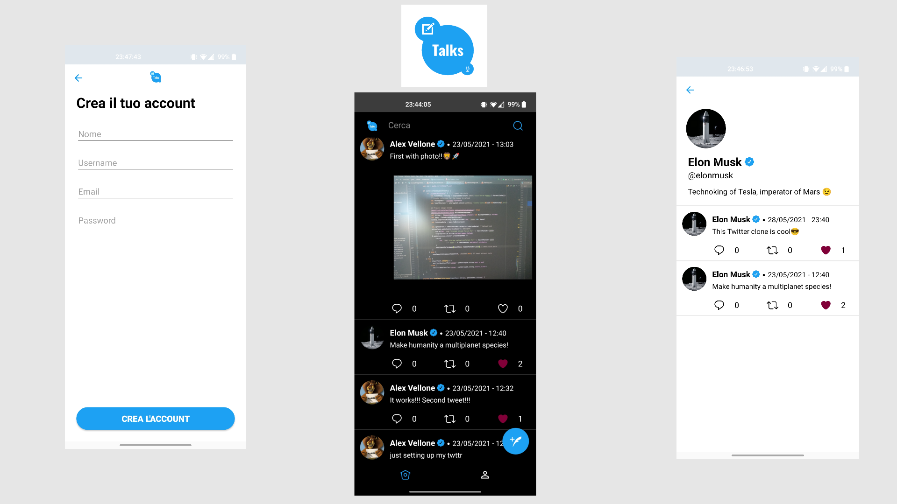
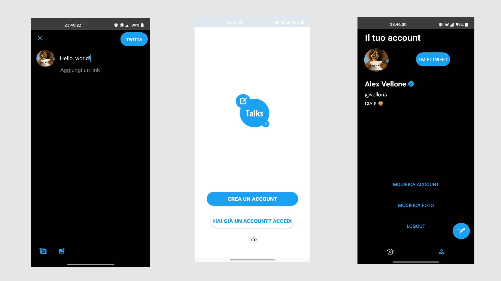

# Talks - Twitter clone

Un social network simile a Twitter. 
Tutti gli utenti registrati possono condividere post di massimo 500 caratteri, con eventualmente una foto.
L'utente, quando creerà un nuovo post, potrà opzionalmente inserire un link della fonte, 
nel caso voglia commentare delle informazioni di carattere pubblico.

## Backend
L'architettura di questa applicazione si basa su Google Firebase.
- Firebase Auth: gestione utenti
- Firebase Firestore database: users collection e tweets collection
- Firebase Storage: per memorizzare foto profilo e media dei tweet
- Firebase Crashlytics: per raccolta errori runtime
- Firebase Analytics: per monitoraggio utenti

## Funzionalità
- Tema applicazione dinamico (bianco o nero)
- Registrazione con email e password
- Login con email e password
- Reset password con email
- Logout
- Modifica informazioni account: nome, username, bio del profilo, immagine di profilo
- Badge di account verificato per gli utenti idonei
- Visualizzazione di tutti i tweet nella bacheca
- Visualizzazione dei tweet di un utente (cliccando sulla sua foto) (Pagina dettaglio utente)
- Possibilità di mettere e togliere like ai tweet
- Creazione di un tweet con solo testo
- Creazione di un tweet con testo e immagine (dalla galleria o scattata al momento)
- Barra di ricerca per filtrare il testo dei tweet
- Scroll verso il basso per caricare i nuovi tweet
- Lingue supportate: italiano e inglese (dinamicamente)

Copyright © 2021 Alex Vellone
